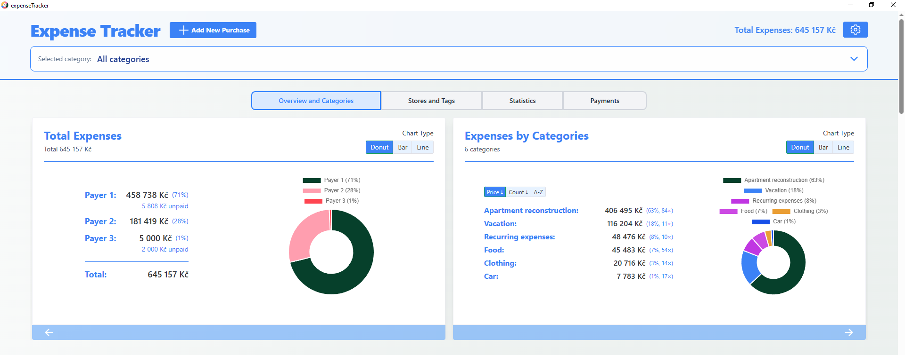
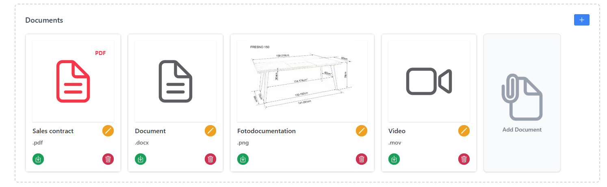

# Expense Tracker

> **Visit
> [README.md](https://github.com/DanielPaviza/ExpenseTracker/blob/main/README.md)
> for Czech translation**

## Summary

Expense Tracker is an offline desktop application for tracking personal
expenses. You can record purchases with detailed metadata (category, store,
tags, payer, documents) and analyze your expenses using interactive cards and
charts on the dashboard.

>  _Application
> overview_

**Key highlights:**

- Dashboard with charts, statistics, payment overview, and category breakdown
- Multiple table views with filtering, sorting, and grouping
- Ability to add attachments (receipts, documents) to individual purchases
- Bulk renaming or removal of tags across all entries at once
- Support for Czech and English
- Fully offline — all data stored locally as JSON files

---

## For Developers

If you want to run the app from source:

```bash
pnpm install
pnpm tauri dev
```

Useful commands:

```bash
pnpm dev          # browser-only frontend
pnpm build        # frontend build
pnpm tauri build  # production desktop bundle
```

See `src/` (Vue frontend) and `src-tauri/` (Rust/Tauri backend).

---

## Quick Start (Users)

### 1) Install

- Download the latest installer from releases.
- Open the app.

### 2) First Launch

- The app creates its data files automatically.
- No account, cloud sync, or subscription is required.

### 3) Main Workflow

1. Click **Add New Purchase**.
2. Fill in the required fields.
3. Optionally add tags, notes, a URL, and documents.
4. Click **Create Purchase**.
5. Use **Save Changes** in the header to persist to disk.

---

## What the App Does

>  _App overview
> with dashboard and header_

- Track purchases by category, subcategory, store, payer, and tags.
- Analyze spending with dashboard cards and charts.
- Switch between table views (all items, by category, by store, by tag).
- Bulk rename or delete labels (categories, subcategories, stores, tags).
- Attach receipts and documents to purchases.
- Work in English or Czech.
- Keep automatic backup snapshots on app close.

---

## User Guide

### Header & Navigation

>  _Header with category
> bar, total expenses, and pending-changes indicator_

- **Add New Purchase** opens the purchase form.
- **Total Expenses** shows the current paid total for the active scope.
- **Settings** opens the settings drawer.
- **Unsaved Changes** appears when in-memory state differs from disk; provides
  **Save** and **Discard** actions.
- **Category bar** opens category selection and changes the app-wide scope.

### Category View

>  _Category
> selector with stat cards per category_

Selecting a category filters the entire app (table, dashboard, and stats).  
Choose **All Categories** to remove filtering.

### Add or Edit a Purchase

>  _New purchase form
> with basic fields (left) and additional fields (right)_

**Required fields:**

- Category
- Subcategory
- Type
- Name
- Payer
- Quantity
- Unit Price

**Optional fields:**

- Store, Tags, Group
- Creation Date
- URL / Technical Document
- Description
- Documents (attachments)

**Status flags:**

- **Not Yet Paid** — excluded from paid totals, shown as outstanding.
- **Saved / Free** — excluded from paid totals, shown as saved.

### Save Model

> **Important:** Changes are applied in memory immediately but are not written
> to disk until you explicitly save.

- **Save Changes** — writes the current state to disk.
- **Discard Changes** — restores the last saved state.
- Closing the app with unsaved changes shows a confirmation dialog.

### Table Views, Filters, and Grouping

Four table views are available:

- **All in One** — flat list of all purchases.
- **By Categories / Subcategories** — grouped sections by category.
- **By Stores** — grouped by store.
- **By Tags** — grouped by tag.

>  _"All in One" table view_

>  _"By Categories" table
> view_

Additional tools:

- Per-column filtering and sorting.
- Section sorting (alphabetical or by total spend).
- Hidden columns selector.
- Group-based subtables for rows sharing the same **Group** value.

### Bulk Edit

>  _Bulk edit form for
> renaming a subcategory across all categories_

Use bulk edit to rename or delete labels across many records at once:

- Rename category, subcategory, store, or tag values in one action.
- Delete category, subcategory, or store globally or by scope.
- Deleting a tag removes it from all purchases (does not delete the purchases
  themselves).

### Dashboard

> 
> _Overview & Categories card with donut chart and category list_

Dashboard cards:

- **Overview and Categories / Subcategories**
- **Stores and Tags**
- **Statistics**
- **Payments** (Unpaid + Free/Saved)

>  _Stores
> and Tags card with store list and visit counts_

>  _Statistics
> card showing averages, trends, and recent purchases_

>  _Payments card
> showing unpaid items and saved/free items_

### Settings

>  _Settings drawer with
> language, currency, and default view options_

Available settings:

- Language (English / Czech)
- Currency symbol
- Subtables opened by default
- Default dashboard card
- Default startup category

### Documents & Attachments

>  _Purchase form
> document section with uploaded file cards_

- Attach files (receipts, invoices, etc.) to individual purchases.
- Files are stored in a `Documents/` folder alongside the app database.
- Display names can be renamed within the UI.
- Download or remove files from a purchase at any time.
- Attachments download to the system's default download directory.
- Images and PDF files can be previewed directly in the app.

---

## Data, Privacy, and Backups

- All data is stored locally on your machine — nothing is sent to the cloud.
- Main data files:
  - `expenseTrackerDb.json` — purchase records
  - `settings.json` — app settings
- An automatic backup is created each time the app window closes.
- Backups are stored in a `Backups/` folder with timestamped file names.

**To restore a backup:**

1. Close the app.
2. Copy the desired backup file over `expenseTrackerDb.json`.
3. Reopen the app.
