# Expense Tracker

> **Visit [README.en.md](https://github.com/DanielPaviza/ExpenseTracker/blob/main/README.en.md) for English translation**

## Přehled

Expense Tracker je offline desktopová aplikace pro sledování osobních výdajů.
Lze zaznamenávat nákupy s podrobnými metadaty (kategorie, obchod, tagy, plátce,
dokumenty), analyzovat výdaje pomocí interaktivních karet a grafů na dashboardu.

> 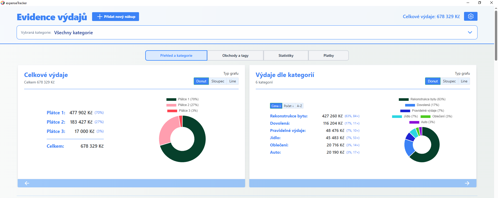 _Přehled aplikace_

**Klíčové vlastnosti:**

- Dashboard s grafy, statistikami, přehledem plateb a rozpisem kategorií
- Vícero tabulkových zobrazení s filtrováním, řazením a seskupováním
- Možnost přidání přílohy (účtenky, dokumenty) k jednotlivým nákupům
- Hromadné přejmenování nebo odstranění tagů ve všech záznamech najednou
- Podpora češtiny a angličtiny
- Plně offline — všechna data uložena lokálně jako JSON soubory

---

## Pro vývojáře

Spuštění aplikace ze zdrojového kódu:

```bash
pnpm install
pnpm tauri dev
```

Užitečné příkazy:

```bash
pnpm dev          # frontend pouze v prohlížeči
pnpm build        # sestavení frontendu
pnpm tauri build  # produkční desktopový balíček
```

Zdrojový kód frontendu je v `src/`, backend (Rust/Tauri) v `src-tauri/`.

---

## Rychlý start (Uživatelé)

### 1) Instalace

- Stáhněte nejnovější instalátor z releases.
- Otevřete aplikaci.

### 2) První spuštění

- Aplikace automaticky vytvoří potřebné datové soubory.
- Není potřeba žádný účet, cloudová synchronizace ani předplatné.

### 3) Základní postup

1. Klikněte na **Přidat nový nákup**.
2. Vyplňte povinná pole.
3. Volitelně přidejte tagy, poznámky, URL a dokumenty.
4. Klikněte na **Vytvořit nákup**.
5. Pomocí **Uložit změny** v záhlaví uložte data na disk.

---

## Co aplikace umí

> 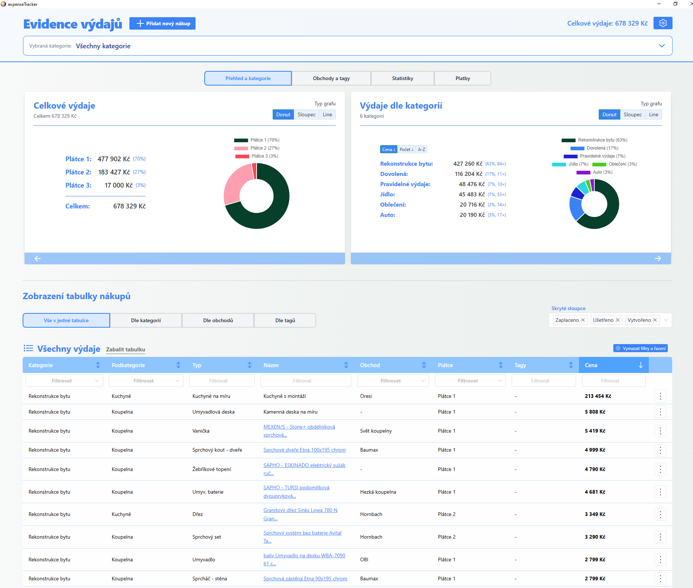 _Přehled aplikace s
> dashboardem a záhlavím_

- Sledování nákupů podle kategorie, podkategorie, obchodu, plátce a tagů.
- Analýza výdajů pomocí karet a grafů na dashboardu.
- Přepínání mezi zobrazeními tabulky (vše, podle kategorie, podle obchodu, podle
  štítku).
- Hromadné přejmenování nebo odstranění tagů (kategorie, podkategorie, obchody,
  tagy).
- Přikládání účtenek a dokumentů k nákupům.
- Rozhraní v češtině nebo angličtině.
- Automatické zálohovací snímky při zavření aplikace.

---

## Uživatelský návod

### Záhlaví a navigace

> 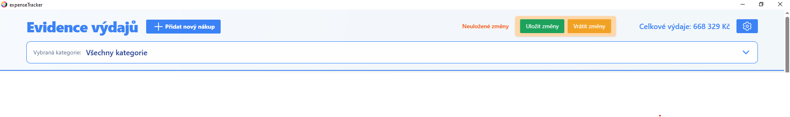 _Záhlaví s lištou kategorií,
> celkovými výdaji a indikátorem neuložených změn_

- **Přidat nový nákup** otevře formulář nákupu.
- **Celkové výdaje** zobrazuje aktuální zaplacený součet pro aktivní rozsah.
- **Nastavení** otevře panel nastavení.
- **Neuložené změny** se zobrazí, pokud se stav v paměti liší od disku; nabízí
  akce **Uložit** a **Zahodit**.
- **Lišta kategorií** otevře výběr kategorií a změní celoapplikační rozsah.

### Zobrazení kategorií

> 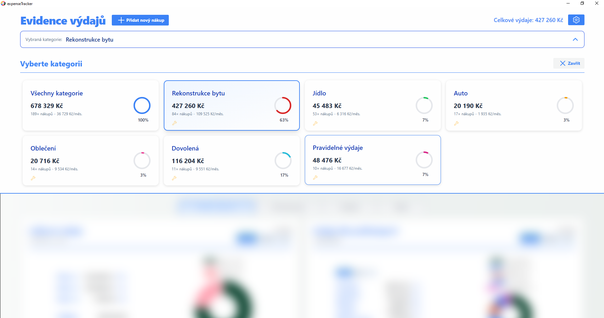 _Panel
> výběru kategorií se statistickými kartami pro každou kategorii_

Výběr kategorie filtruje celou aplikaci (tabulku, dashboard i statistiky).  
Zvolte **Všechny kategorie** pro zrušení filtru.

### Přidat nebo upravit nákup

> 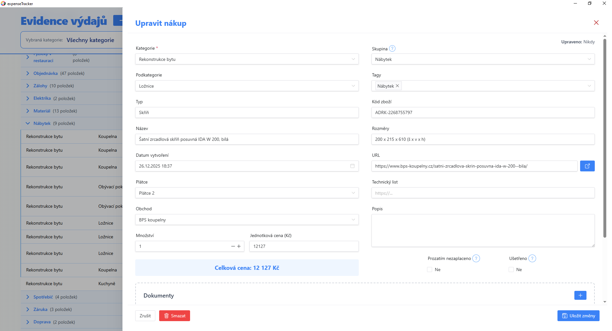 _Formulář nového
> nákupu se základními poli (vlevo) a doplňkovými poli (vpravo)_

**Povinná pole:**

- Kategorie
- Podkategorie
- Typ
- Název
- Plátce
- Množství
- Jednotková cena

**Volitelná pole:**

- Obchod, Tagy, Skupina
- Datum vytvoření
- URL / Technický dokument
- Popis
- Dokumenty (přílohy)

**Stavové příznaky:**

- **Ještě nezaplaceno** — vyloučeno z placených součtů, zobrazeno jako
  nevyřízené.
- **Uloženo / Zdarma** — vyloučeno z placených součtů, zobrazeno jako uložené.

### Model ukládání

> **Důležité:** Změny jsou okamžitě aplikovány v paměti, ale na disk se
> nezapíší, dokud je explicitně neuložíte.

- **Uložit změny** — zapíše aktuální stav na disk.
- **Zahodit změny** — obnoví poslední uložený stav.
- Zavření aplikace s neuloženými změnami zobrazí potvrzovací dialog.

### Zobrazení tabulky, filtry a seskupování

K dispozici jsou čtyři zobrazení tabulky:

- **Vše v jednom** — plochý seznam všech nákupů.
- **Podle kategorií / podkategorií** — sekce seskupené podle kategorií.
- **Podle obchodů** — seskupeno podle obchodu.
- **Podle tagů** — seskupeno podle štítku.

>  _Zobrazení „Vše v
> jednom"_

> 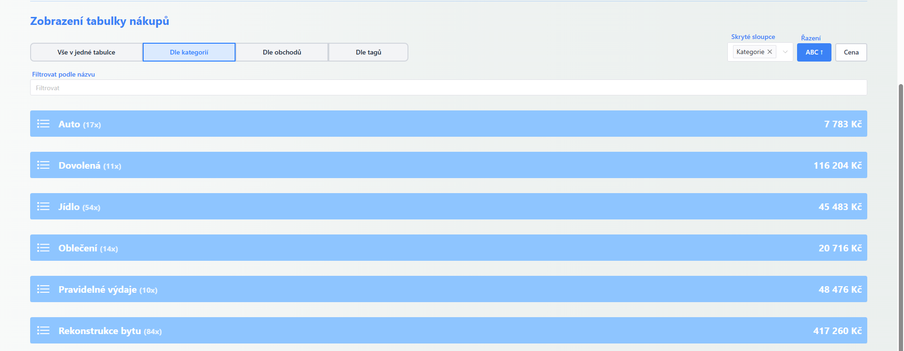 _Zobrazení „Podle
> kategorií"_

Další nástroje:

- Filtrování a řazení podle sloupců.
- Řazení sekcí (abecedně nebo podle celkových výdajů).
- Výběr skrytých sloupců.
- Podtabulky pro řádky se stejnou hodnotou **Skupiny**.

### Hromadné úpravy

> 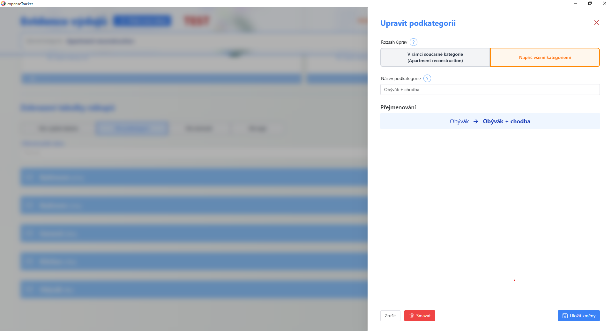 _Formulář
> hromadných úprav pro přejmenování podkategorie napříč všemi kategoriemi_

Hromadné úpravy slouží k přejmenování nebo odstranění tagů ve více záznamech
najednou:

- Přejmenování hodnot kategorie, podkategorie, obchodu nebo štítku v jedné akci.
- Odstranění kategorie, podkategorie nebo obchodu globálně nebo v rámci rozsahu.
- Odstranění štítku ho odstraní ze všech nákupů (samotné nákupy se nesmaží).

### Dashboard

> 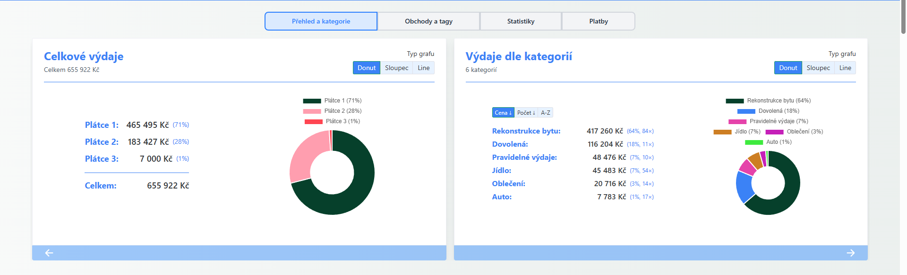
> _Karta Přehled a Kategorie s prstencovým grafem a seznamem kategorií_

Karty dashboardu:

- **Přehled a Kategorie / Podkategorie**
- **Obchody a Tagy**
- **Statistiky**
- **Platby** (Nezaplaceno + Zdarma/Uloženo)

> 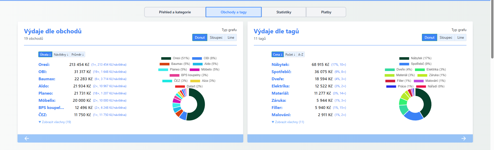 _Karta
> Obchody a Tagy se seznamem obchodů a počtem návštěv_

> 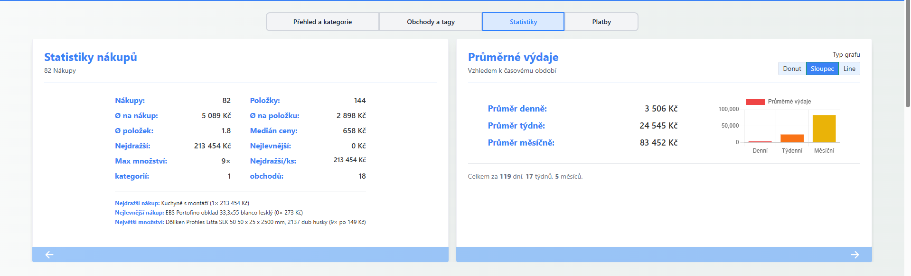 _Karta
> Statistiky zobrazující průměry, trendy a poslední nákupy_

> 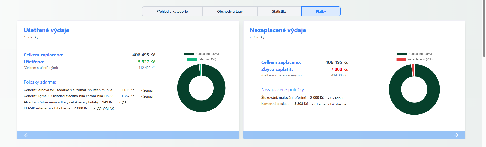 _Karta Platby
> zobrazující nezaplacené položky a uložené/bezplatné položky_

### Nastavení

> 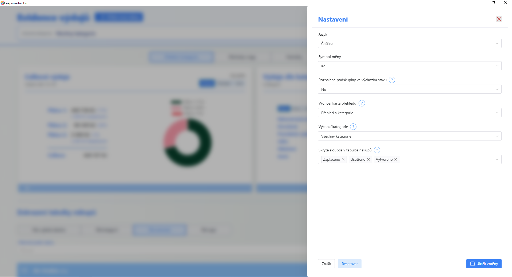 _Panel nastavení s
> volbami jazyka, měny a výchozích zobrazení_

Dostupné možnosti:

- Jazyk (čeština / angličtina)
- Symbol měny
- Podtabulky otevřené ve výchozím stavu
- Výchozí karta dashboardu
- Výchozí startup kategorie

### Dokumenty a přílohy

> 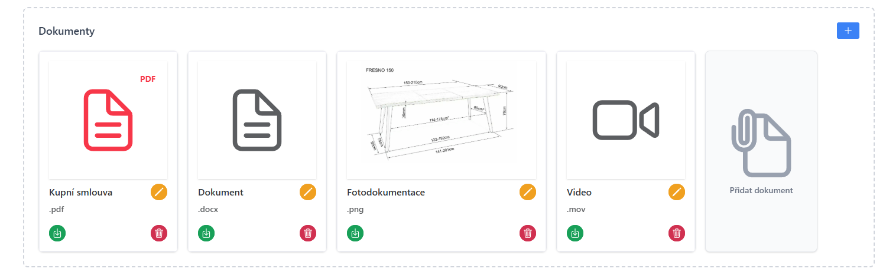 _Sekce dokumentů ve
> formuláři nákupu s kartami nahraných souborů_

- Přikládání souborů (účtenky, faktury atd.) k jednotlivým nákupům.
- Soubory jsou uloženy ve složce `Documents/` vedle databáze aplikace.
- Zobrazované názvy lze přejmenovat přímo v aplikaci.
- Soubory lze kdykoli stáhnout nebo odebrat z nákupu.
- Přílohy se stahují do výchozího adresáře pro stahování systému.
- Obrázky a soubory PDF lze prohlížet přímo v aplikaci.

---

## Data, soukromí a zálohy

- Veškerá data jsou uložena lokálně na vašem počítači — nic se neodesílá do
  cloudu.
- Hlavní datové soubory:
  - `expenseTrackerDb.json` — záznamy o nákupech
  - `settings.json` — nastavení aplikace
- Automatická záloha je vytvořena při každém zavření okna aplikace.
- Zálohy jsou uloženy ve složce `Backups/` s názvy souborů obsahujícími časové
  razítko.

**Obnovení zálohy:**

1. Zavřete aplikaci.
2. Zkopírujte požadovaný soubor zálohy přes `expenseTrackerDb.json`.
3. Znovu otevřete aplikaci.
