# Expense Tracker

Private, desktop-first expense tracking app built with Vue + Tauri.  
Track purchases, attach files, view spending analytics, and keep all data locally on your device.

---

## For Developers (Minimal)

If you want to run the app from source:

```bash
pnpm install
pnpm tauri dev
```

Useful commands:

```bash
pnpm dev          # browser-only frontend
pnpm build        # frontend build
pnpm tauri build  # production desktop bundle
```

See project files in `src/` (frontend) and `src-tauri/` (backend).

---

## Quick Start (Users)

### 1) Install

- Download the latest installer from releases.
- Open the app.

### 2) First launch

- The app creates its data files automatically.
- No account, cloud sync, or subscription is required.

### 3) Main workflow

1. Click **Add New Purchase**.
2. Fill the required fields.
3. Optionally add tags, notes, URL, and documents.
4. Click **Create Purchase**.
5. Use **Save Changes** in the header to persist to disk.

---

## What the App Does

> 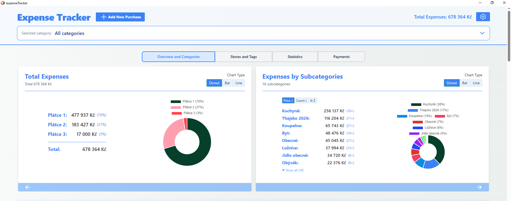
> *App overview with dashboard and header*

- Track purchases by category, subcategory, store, payer, and tags.
- Analyze spendings with dashboard cards and charts.
- Switch between table views (all items, by category, by store, by tag).
- Bulk rename/delete labels (for categories, subcategories, stores, tags).
- Attach receipts/documents to purchases.
- Work in English or Czech.
- Keep automatic backup snapshots on app close.

---

## User Guide

### Header & Navigation

> 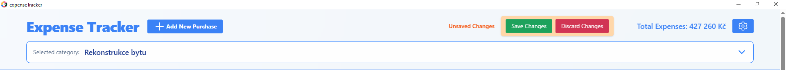
> *Header with category bar, total expenses, and pending-changes indicator*

- **Add New Purchase** opens the form.
- **Total Expenses** shows current paid total for active scope.
- **Settings** opens the settings drawer.
- **Unsaved Changes** shows when memory differs from disk and provides **Save** / **Discard**.
- **Category bar** opens category selection and changes app-wide scope.

### Category View

> 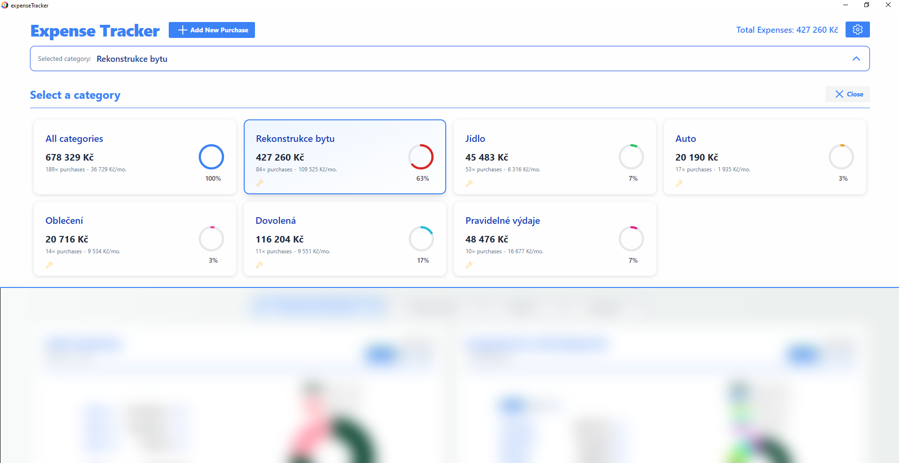
> *Category selector with stat cards per category*

Selecting a category filters the whole app (table + dashboard + stats).  
Choose **All categories** to remove filtering.

### Add or Edit a Purchase

> 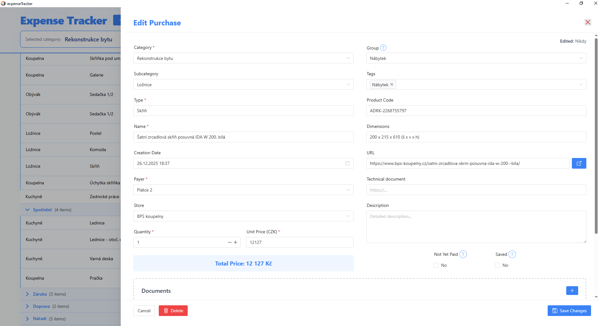
> *New purchase drawer with basic fields (left) and additional fields (right)*

Required fields:

- Category
- Subcategory
- Type
- Name
- Payer
- Quantity
- Unit Price

Useful optional fields:

- Store, Tags, Group
- Creation Date
- URL / Technical Document
- Description
- Documents (attachments)

Status flags:

- **Not Yet Paid**: excluded from paid totals, shown as outstanding.
- **Saved / Free**: excluded from paid totals, shown as saved.

### Save Model (Important)

- Changes are applied in memory immediately.
- Nothing is written to disk until **Save Changes**.
- **Discard Changes** restores last saved state.
- Closing the app with unsaved changes shows a confirmation dialog.

### Table Views, Filters, and Grouping

- **All in One**: flat list of all purchases.
- **By Categories / Subcategories**: grouped sections.
- **By Stores**: grouped by store.
- **By Tags**: grouped by tag.

> 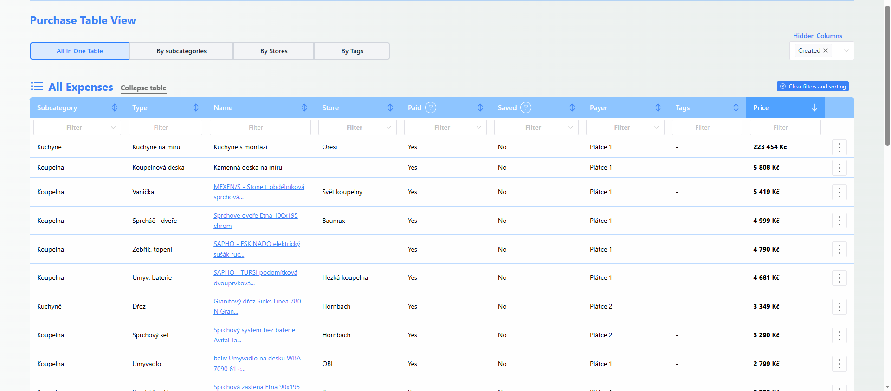
> *"All in one table" view*

> 
> *"By Categories" view*

Additional tools:

- Per-column filtering.
- Per-column sorting.
- Section sorting (alphabetical or by total spend).
- Hidden columns selector.
- Group-based subtables for rows sharing the same **Group** value.

### Bulk Edit

> 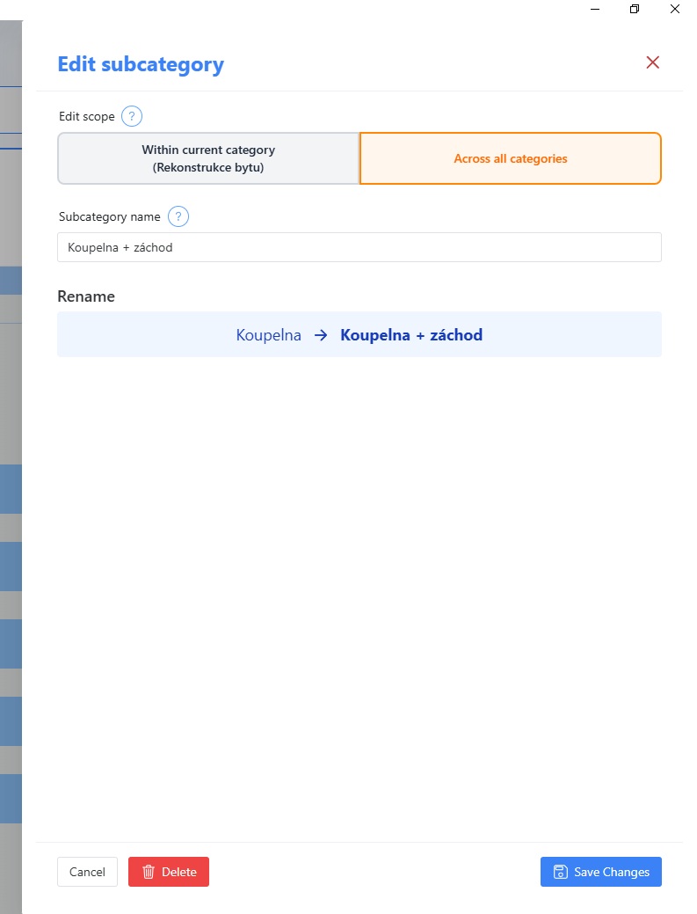
> *Bulk edit drawer for renaming a subcategory across all categories*

Use bulk edit to rename or delete labels across many records at once.

- Rename category/subcategory/store/tag values in one action.
- Delete category/subcategory/store globally or by scope.
- Deleting a tag removes the tag from purchases (does not delete purchases).

### Dashboard

> 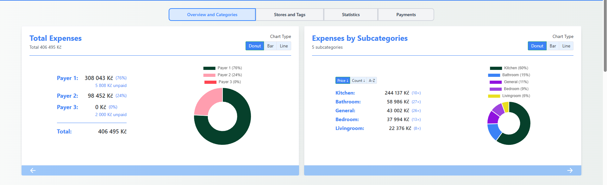
> *Screenshot placeholder — Overview & Categories card with donut chart and category list*

Dashboard cards:

- Overview and Categories / Subcategories
- Stores and Tags
- Statistics
- Payments (Unpaid + Free/Saved)

More placeholders:

> 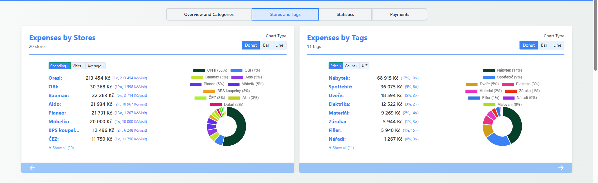
> *Screenshot placeholder — Stores and Tags card with store list and visit counts*

> 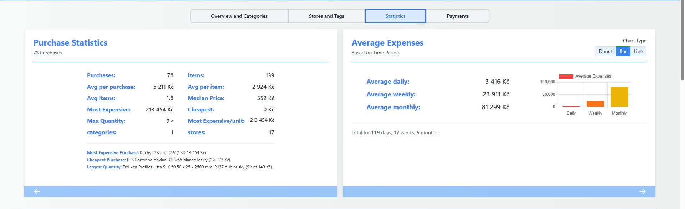
> *Screenshot placeholder — Statistics card showing averages, trends, and recent purchases*

> 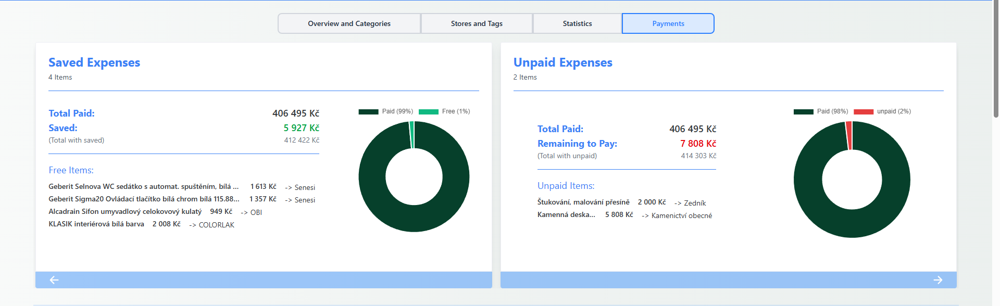
> *Screenshot placeholder — Payments card showing unpaid items and saved/free items*

### Settings

> 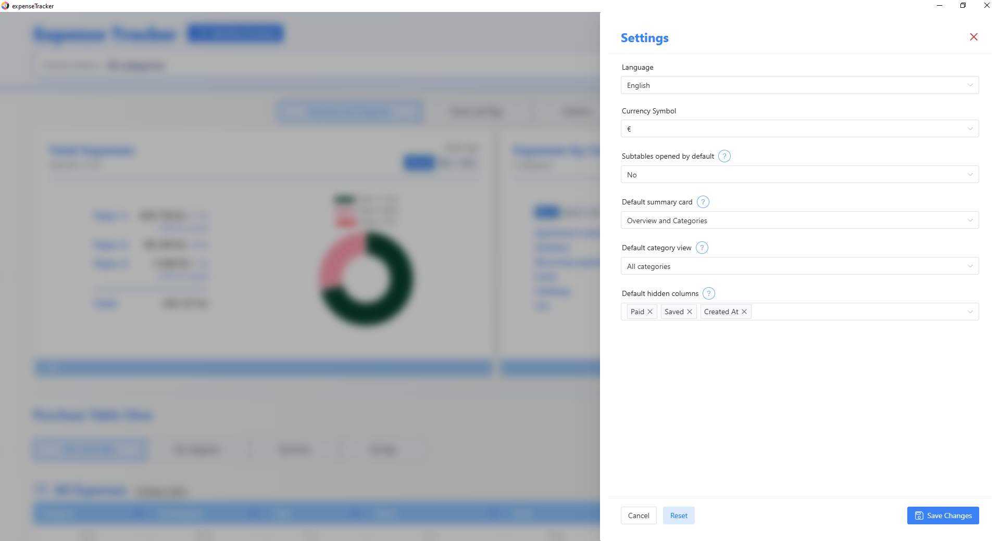
> *Screenshot placeholder — Settings drawer with language, currency, and default view options*

Available settings:

- Language (English / Czech)
- Currency symbol
- Subtables opened by default
- Default dashboard card
- Default startup category

### Documents & Attachments

> 
> *Screenshot placeholder — spending form document section with uploaded file cards*

- Add files by drag-and-drop or file picker.
- Files are stored in a `Documents/` folder near the app database.
- Display names can be renamed in the UI.
- Download or remove files from a purchase.
- Attachments download to the systems default download directory.
---

## Data, Privacy, and Backups

- Data is stored locally on your machine.
- Main files:
  - `expenseTrackerDb.json` (purchase records)
  - `settings.json` (app settings)
- Automatic backup is created when the app window closes.
- Backups are stored in `Backups/` with timestamped file names.

Restore backup:

1. Close the app.
2. Copy a backup file over `expenseTrackerDb.json`.
3. Reopen the app.